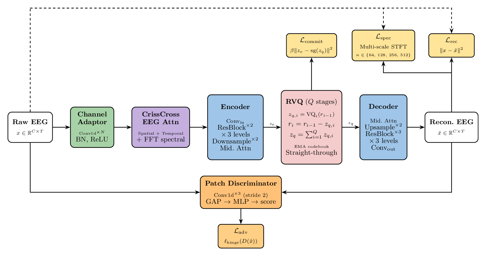
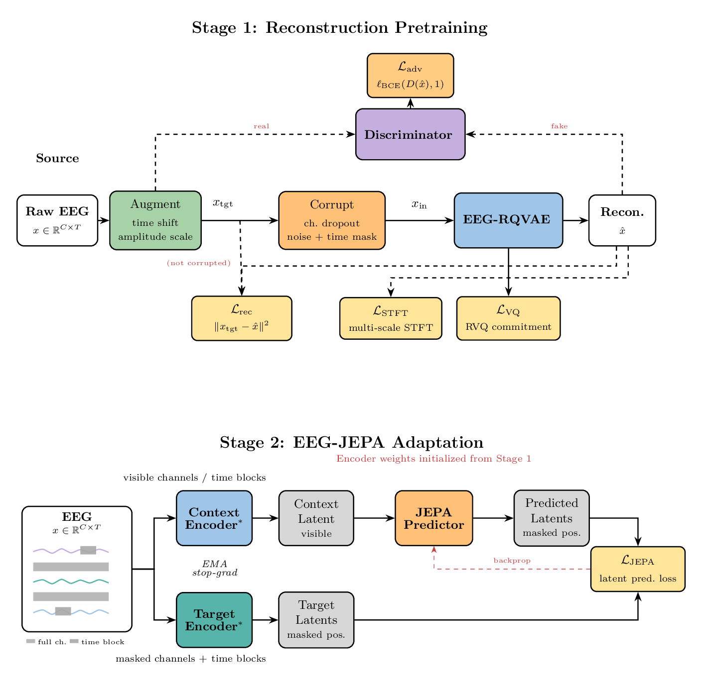
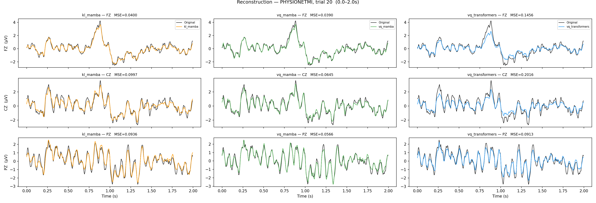
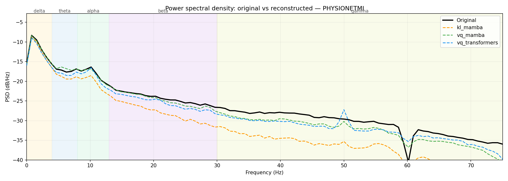
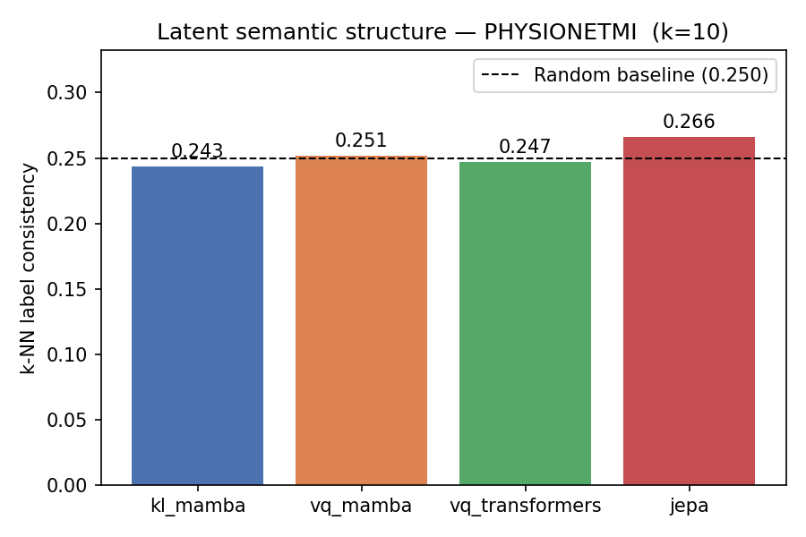

# EEG-RQVAE

**A Residual Quantized Variational Autoencoder for self-supervised EEG representation learning.**

EEG-RQVAE is an EEG foundation model that learns **discrete, hierarchical EEG tokens** through a
two-stage pretraining pipeline: a *denoising adversarial reconstruction* stage that builds a compact
residual-vector-quantized codebook, followed by a *JEPA-style* stage that refines the encoder purely
in latent space — without any signal-level reconstruction pressure. A linear-time **bidirectional
Mamba** backbone models long, multi-channel recordings efficiently.

Under a unified, fully **subject-independent linear-probing** benchmark spanning twelve BCI datasets,
a frozen **RVQ-Mamba** encoder is the most consistent variant — best or second-best on every evaluated
task — and improves over recent EEG foundation models on motor-imagery (BCI IV-2a), emotion (SEED-V),
pathology (TUAB) and sleep-staging (Sleep-EDF) tasks.

<p align="center">
  
</p>

> A raw EEG window is projected by a channel adaptor, mixed by a spatio-temporal block (CrissCross
> attention or Mamba), encoded into a compact latent `z_e`, and discretized by a residual vector
> quantizer (RVQ, `Q` stages) into `z_q`. A symmetric decoder reconstructs the signal during Stage 1
> only. Losses: reconstruction `L_rec`, multi-scale spectral `L_spec`, commitment `L_commit`,
> adversarial `L_adv`.

---

## Highlights

- **EEG-RQVAE** — a residual vector-quantized VAE for multi-channel EEG that produces discrete,
  hierarchical token sequences suitable for both generative and discriminative downstream use.
- **Two-stage pretraining** — denoising adversarial reconstruction (Stage 1) + latent JEPA adaptation
  (Stage 2) to progressively enforce semantic representation learning.
- **Linear-time SSM backbone** — bidirectional Mamba-2 blocks model long EEG sequences in `O(T)`,
  with Transformer (CrissCross attention) variants for comparison.
- **Fair, subject-independent benchmark** — a standardized linear-probing protocol across 12 BCI tasks
  under a single, dataset-agnostic preprocessing pipeline.

---

## Two-stage pretraining pipeline

<p align="center">
  
</p>

**Stage 1 — Denoising reconstruction.** Each window is *augmented* to a clean target `x_tgt`
(time shift, amplitude scaling, channel dropout, Gaussian noise, time masking), then independently
*corrupted* into the model input `x_in`. The encoder–RVQ–decoder is trained to reconstruct `x_tgt`
from `x_in` with a smooth-ℓ1 loss, a multi-scale STFT spectral loss, an RVQ commitment loss, and a
patch-discriminator adversarial loss (enabled after epoch 5).

**Stage 2 — Latent JEPA adaptation.** The decoder and codebook are frozen; only the encoder is updated.
The temporal latent sequence is split into blocks, 25% are masked, and a narrow Transformer predictor
predicts the masked latents from visible context. Targets come from an EMA copy of the encoder. The loss
is computed entirely in latent space, biasing learning toward structured, semantic features.

---

## Results (linear probing, frozen backbone)

Balanced accuracy (BACC), subject-independent splits. **Bold** = best, _italic_ = second best.
Full metrics (κ, macro-F1) and additional datasets are reported in the paper.

| Model | BCI2A | PhysioNetMI | FACED | SEED-V | TUAB | Sleep-EDF |
|---|:--:|:--:|:--:|:--:|:--:|:--:|
| EEGPT      | 0.347 | _0.573_ | 0.413 | 0.269 | _0.744_ | _0.625_ |
| CBraMod    | _0.439_ | 0.472 | 0.332 | _0.278_ | 0.732 | 0.457 |
| EEGMamba   | 0.408 | **0.578** | **0.471** | 0.257 | 0.732 | 0.584 |
| **RVQ-Mamba (ours)** | **0.484** | 0.519 | 0.325 | **0.289** | **0.767** | **0.727** |

A frozen RVQ-Mamba encoder is best on 4/6 tasks and competitive on the rest.

### Ablation — architecture & pretraining objective (BACC)

| Dataset | KL-Mamba | RVQ-Mamba | RVQ-Transformer | JEPA |
|---|:--:|:--:|:--:|:--:|
| BCI2A       | 0.456 | **0.484** | _0.469_ | 0.443 |
| PhysioNetMI | _0.536_ | 0.519 | 0.528 | **0.538** |
| FACED       | 0.306 | **0.325** | 0.262 | _0.315_ |
| SEED-V      | _0.287_ | **0.289** | 0.280 | 0.283 |

Residual quantization sharpens discriminability (KL → RVQ); the Mamba backbone matters most on the
high-channel emotion task (FACED); Stage-2 JEPA helps motor imagery but is task-dependent. RVQ-Mamba is
the most consistent variant overall.

---

## Pretraining analysis

Computed on held-out PhysioNet MI windows (see [`pretraining_evaluation.ipynb`](pretraining_evaluation.ipynb)).

| Stage 1 — time domain | Stage 1 — frequency domain | Stage 2 — latent semantics |
|:--:|:--:|:--:|
|  |  |  |
| Reconstructed vs. original waveforms | PSD match across δ–β bands | k-NN label consistency (k=10) |

Stage 1 yields high-fidelity reconstructions (RVQ even slightly improves spectral fidelity over the
continuous KL bottleneck). Only the Stage-2 JEPA encoder rises clearly above the random k-NN baseline,
confirming that latent prediction — not signal reconstruction — drives semantic structure.

---

## Repository structure

```
EEG-VAE/
├── eeg_vae/                  # Core model
│   ├── eeg_vae.py            # EEGVAE (encoder–RVQ/KL–decoder)
│   ├── discriminator.py      # Patch discriminator (Stage 1 adversarial loss)
│   ├── jepa.py               # Stage 2 JEPA wrapper (context/target encoder + predictor)
│   └── modules/              # channel adaptor, encoder, decoder, RVQ, KL, predictor, ...
├── models/                   # Downstream backbones + probe heads
│   ├── model.py              # Backbone factory / wrapper
│   ├── *_probe_head.py       # Linear-probe heads per backbone
│   └── {eegpt,cbramod,eegmamba,femba,luna,reve}/   # Baseline foundation models
├── utils/                    # Trainers, parsers, losses, metrics
├── configs/                  # YAML configs (see below)
├── jobs/                     # SLURM sbatch scripts
├── main_pretraining.py       # Stage 1 entry point
├── main_jepa.py              # Stage 2 entry point
├── main_downstream.py        # Linear probing / fine-tuning entry point
├── pretraining_evaluation.ipynb   # Reconstruction / PSD / latent analysis
└── article/                  # Paper sources and figures
```

---

## Installation

> No packaging file is shipped yet; install the dependencies into a Python ≥ 3.10 environment.

Core dependencies:

```bash
pip install torch mamba-ssm numpy scipy scikit-learn matplotlib mne torcheeg safetensors pyyaml lmdb
```

The data pipeline (LMDB loaders, channel mapping, augmentations) lives in a separate
`eeg_preprocessing` package, imported by the entry points as
`from eeg_preprocessing.loaders import ...`. Make sure it is installed and importable.
`mamba-ssm` requires a CUDA-capable GPU.

---

## Usage

Each entry point reads its YAML config from `configs/` and can override any field from the command
line with `--use_parsing`.

**Stage 1 — denoising reconstruction pretraining**
```bash
python main_pretraining.py                 # reads configs/pretraining.yaml
# or on a SLURM cluster:
sbatch jobs/pretraining.sbatch
```

**Stage 2 — latent JEPA adaptation**
```bash
python main_jepa.py                        # reads configs/jepa.yaml (set phase1.checkpoint)
sbatch jobs/jepa.sbatch
```

**Downstream — linear probing / fine-tuning**
```bash
# Use configs/downstream.yaml as-is:
python main_downstream.py

# Or override fields on the CLI:
python main_downstream.py --use_parsing \
    --dataset_name BCI2A \
    --model_name EEGVAE \
    --mode linear_probing \
    --model_weights /path/to/pretraining_final.pt \
    --channel_mode raw

# Full sweep over datasets / seeds / models:
sbatch jobs/full_downstream.sbatch
```

`model_name` selects the backbone (`EEGVAE`, `CBRAMOD`, `EEGMAMBA`, `LUNA`, `FEMBA`, `EEGPT`, `REVE`);
`mode` selects the evaluation protocol (`linear_probing`, `channel_training`, `finetuning`,
`full_training`). Baseline checkpoint paths are configured in `configs/model_configs.yaml`.

### Configuration

| File | Purpose |
|---|---|
| [`configs/pretraining.yaml`](configs/pretraining.yaml) | Stage 1: data, augmentations, model (`kl`/`vq`), losses, discriminator |
| [`configs/jepa.yaml`](configs/jepa.yaml) | Stage 2: Stage-1 checkpoint, JEPA masking, EMA, predictor |
| [`configs/downstream.yaml`](configs/downstream.yaml) | Linear probing: dataset registry, backbone, optimizer, metrics |
| [`configs/model_configs.yaml`](configs/model_configs.yaml) | Baseline foundation-model checkpoints and hyper-parameters |

---

## Pretraining & evaluation data

Pretraining uses the **TUH EEG Corpus (TUEG)** (10% of files, 1,385 subjects, 303,686 windows of 30 s
at 200 Hz; TUAB/TUAR excluded to avoid leakage). All signals share one dataset-agnostic pipeline:
resample to 200 Hz → band-pass 0.5–75 Hz (IIR) → 60 Hz notch → per-channel z-score → fixed-length
windowing → one LMDB record per window.

Evaluation spans twelve downstream BCI datasets across six task families:

| Task | Datasets |
|---|---|
| Abnormal-EEG detection | TUAB |
| Sleep staging | Sleep-EDF Expanded |
| Emotion recognition | SEED-V, FACED |
| Motor imagery | PhysioNet MMI, BCI IV-2a, SHU-MI |
| Seizure detection | Siena, CHB-MIT |
| Imagined speech | BCI 2020 T3, KaraOne, Chisco |

Heterogeneous montages are handled either with a **learned channel adaptor** on native channels
(`channel_mode: raw`) or by projecting onto the 19-channel 10–20 pretraining montage with zero-filling
(`channel_mode: mapped`). Mapping helps on dense montages close to 10–20 but hurts on sparse ones
(e.g. Sleep-EDF), where the raw adaptor is preferred.

---

## Limitations

The discrete codebook's stability depends on corpus scale; pretraining here uses a single corpus at 10%
of its volume; baselines are compared from their public checkpoints rather than re-pretrained; the
Stage-1 loss weighting is fixed and unablated; Stage 2 roughly doubles the pretraining budget for a
task-dependent gain; and the evaluated checkpoints use a unidirectional (causal) Mamba scan even though
the framework is formulated bidirectionally. See the paper for details.

---

## Citation

This repository accompanies the EEG-RQVAE paper (under review). A BibTeX entry will be added here upon
publication.

```bibtex
@misc{eegrqvae,
  title  = {EEG-RQVAE: Residual Quantized Variational Autoencoders for Self-Supervised EEG Representation Learning},
  note   = {Manuscript under review},
  year   = {2026}
}
```
